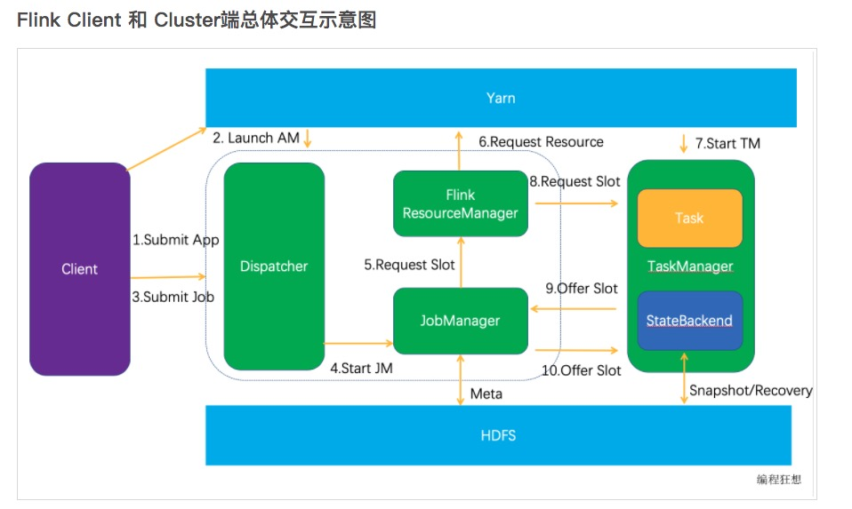
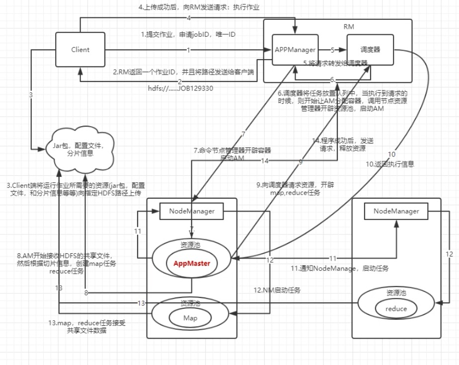

-----------------

-----------------

-----------------

### yarn为什么诞生？
随着计算框架的丰富，人们更希望有统一的资源管理系统；

## RM & NM
可以将RM和NM理解为yarn，RM是主节点，NM是从节点；

### RM：全局资源管理器
#### RM组成部分
- 资源调度器：Resource Scheduler
- 应用程序管理器：Application Manager
 1. RM收到应用程序后，AppManager通知NM创建一个APPMaster，APPMaster负责创建、监控具体应用的map和reduce；
 2. 一个应用程序对应一个APPMaster；
 3. AppMaster也运行在container中；
 功能：
    1. 与RM、scheduler通信，协商执行资源；
    2. 与NM通信，以启动、停止任务，涉及到container；
    3. 监控其下面所有任务的执行状态（map、reduce状态），如果失败，则会重新启动任务来申请资源；
    
- Container
是yarn的资源抽象，封装了某个节点的多维度资源，如内存、CPU、磁盘、网络、IO等；可理解为虚拟机；

### NM：节点资源任务管理器